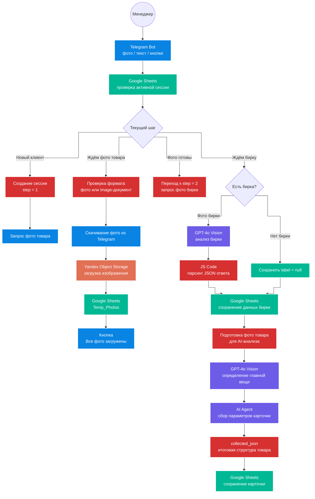

# 📸 Kaspi Photo Bot AI: создание карточек товаров по фото через Telegram

**Kaspi Photo Bot AI** — это Telegram-ассистент для быстрого добавления товаров в каталог Kaspi Магазина по фотографиям.

Система принимает фото товара через Telegram, сохраняет изображения в облачное хранилище, анализирует бирку с помощью AI, помогает собрать параметры карточки через диалог и подготавливает данные для дальнейшей публикации товара в Kaspi.

Проект собран на базе **n8n**, **Telegram Bot API**, **Google Sheets**, **Yandex Object Storage** и **OpenAI GPT-4o Vision**.

---

## 💼 Бизнес-проблема

При добавлении товаров на маркетплейс менеджеру приходится вручную собирать большое количество данных по каждой позиции.

Для одежды это особенно неудобно, потому что нужно подготовить:

- фото товара;
- фото бирки;
- артикул;
- состав;
- страну производства;
- категорию;
- цвет;
- материал;
- сезон;
- размерный ряд;
- остатки по размерам;
- цену;
- название товара;
- данные для дальнейшей публикации в Kaspi.

Если всё делать вручную, процесс занимает много времени и часто приводит к ошибкам:

- фото теряются в переписках;
- ссылки на изображения нужно копировать вручную;
- данные с бирки приходится переписывать руками;
- менеджер может ошибиться в составе, артикуле или размере;
- параметры карточки собираются хаотично;
- товар долго не попадает в каталог;
- сложно масштабировать добавление новых позиций.

---

## ✅ Что было реализовано

Разработан Telegram-бот, который превращает добавление товара в пошаговый сценарий.

Система умеет:

- запускать новую сессию добавления товара;
- принимать несколько фото товара через Telegram;
- проверять, что пользователь отправил именно изображение;
- скачивать фото из Telegram;
- загружать фото в Yandex Object Storage;
- сохранять ссылки на фото в Google Sheets;
- объединять несколько фото в одну товарную сессию;
- показывать кнопку **“Все фото загружены ✅”**;
- запрашивать фото бирки;
- обрабатывать сценарий, если бирки нет;
- анализировать фото бирки через GPT-4o Vision;
- извлекать артикул, состав и страну производства;
- определять главную вещь на фото;
- вести пользователя по сбору параметров карточки;
- задавать вопросы по одному;
- предлагать только допустимые значения из справочника;
- формировать итоговый JSON с данными товара;
- сохранять собранную карточку в Google Sheets.

Главная ценность решения — менеджеру не нужно вручную переносить фото, ссылки и данные с бирки. Бот сам ведёт его по шагам и помогает собрать товарную карточку в структурированном виде.

---

## 🏗 Архитектура

📈 Результат для бизнеса

После внедрения бот упрощает процесс добавления товаров в каталог и снижает ручную работу менеджера.

Система позволяет:

быстрее заводить новые товары в базу;
не терять фотографии товара в переписках;
автоматически сохранять изображения в облако;
собирать все фото товара в одну сессию;
извлекать данные с бирки через AI;
уменьшать ручной ввод артикула, состава и страны;
вести менеджера по понятному сценарию;
снижать ошибки при заполнении карточек;
собирать параметры товара в структурированном виде;
ускорять подготовку товаров к публикации на Kaspi.
🎯 Кому подходит решение

Решение подходит товарному бизнесу, которому нужно быстро добавлять новые позиции в каталог.

Может использоваться в:

магазинах одежды;
продавцах на Kaspi.kz;
локальных брендах;
шоурумах;
интернет-магазинах;
товарных бизнесах с частым обновлением ассортимента;
компаниях, где товары фотографируются вручную;
командах, которые ведут каталог в Google Sheets;
продавцах, которым нужно быстро собирать карточки товаров;
бизнесах, где важно не терять фото, размеры, остатки и данные с бирок.
🛠 Технологический стек
n8n — оркестрация всего сценария добавления товара.
Telegram Bot API — приём фото, текста, callback-кнопок и отправка сообщений пользователю.
Google Sheets — хранение сессий, временных фото, собранных данных и карточек товаров.
Yandex Object Storage / S3 — загрузка и хранение фотографий товара.
OpenAI GPT-4o Vision — анализ фото товара и фото бирки.
AI Agent n8n — диалоговый сбор параметров карточки товара.
Simple Memory — сохранение контекста диалога при заполнении карточки.
JavaScript Code Node — проверка формата сообщений, сбор ссылок, парсинг JSON и подготовка данных.
Switch Node — маршрутизация пользователя по шагам сценария.
Callback-кнопки Telegram — подтверждение завершения загрузки фото.
Temp_Photos — временное хранение ссылок на фотографии в рамках одной сессии.
Sessions — управление состоянием пользователя и этапом заполнения карточки.

👨‍💼 Об авторе

Равиль Муртазин — автор проекта и специалист по AI-автоматизации бизнес-процессов.

Я помогаю бизнесу внедрять практические AI-решения: автоматизировать рутинные процессы, усиливать продажи, улучшать клиентский сервис, работать с данными и выстраивать управленческую аналитику.

В работе использую AI-модели, n8n, Telegram-ботов, CRM-интеграции, Google-сервисы, low-code/no-code платформы и инструменты для построения автономных бизнес-процессов.

Этот проект показывает, как AI и автоматизация могут упростить работу с товарным каталогом: от загрузки фото и анализа бирки до сбора параметров карточки для маркетплейса.

Основные направления работы
AI-автоматизация бизнес-процессов — внедрение решений, которые снимают рутину с сотрудников и ускоряют работу компании.
Чат-боты для продаж и клиентского сервиса — создание ботов, которые консультируют, квалифицируют и доводят клиента до заявки.
AI-консультанты на базе корпоративных знаний — ассистенты, которые отвечают клиентам по базе знаний компании без выдумывания информации.
AI-аналитика и работа с отчётами — ассистенты, которые помогают анализировать документы, таблицы, показатели и управленческие данные.
AI-воронки и автоворонки — автоматизация пути клиента от первого обращения до заявки, записи или покупки.
Автоматизация внутренних отделов — настройка процессов для бухгалтерии, HR, продаж, сервиса и бэкофиса.
Интеграции с CRM, таблицами и Google-сервисами — передача заявок, статусов, отчётов и данных между рабочими системами бизнеса.
Омниканальные боты для сайта и мессенджеров — запуск ассистентов в сайте-виджете, WhatsApp, Telegram, Instagram, ВКонтакте и MAX.
RAG-логика и Function Calling — подключение базы знаний и внутренних функций для точных ответов, записи, бронирования и передачи лидов.
AI-инструменты для руководителей и собственников бизнеса — решения для контроля, аналитики, качества сервиса и управляемости процессов.
📎 Статус проекта

Рабочий прототип Telegram-бота для сбора фото, анализа бирки и подготовки карточек товаров для Kaspi Магазина.

Решение может быть адаптировано под разные категории товаров, маркетплейсы, таблицы, облачные хранилища и внутренние процессы товарного бизнеса.
